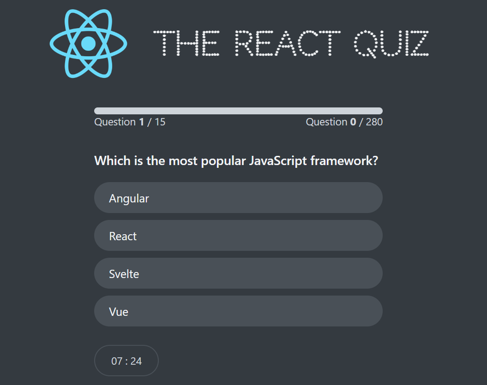

# React Quiz App

A simple and interactive quiz application built with React. This app allows users to take quizzes, view their scores, and review correct answers.

## Features

- **Multiple-choice questions**: Users can select answers from provided options.
- **Score calculation**: The app calculates and displays the user's score at the end of the quiz.

## Technologies Used

- **React**: A JavaScript library for building user interfaces.
- **React Router**: For handling navigation within the app.
- **CSS**: For styling the components.
- **Vite**: A fast build tool for modern web development.
